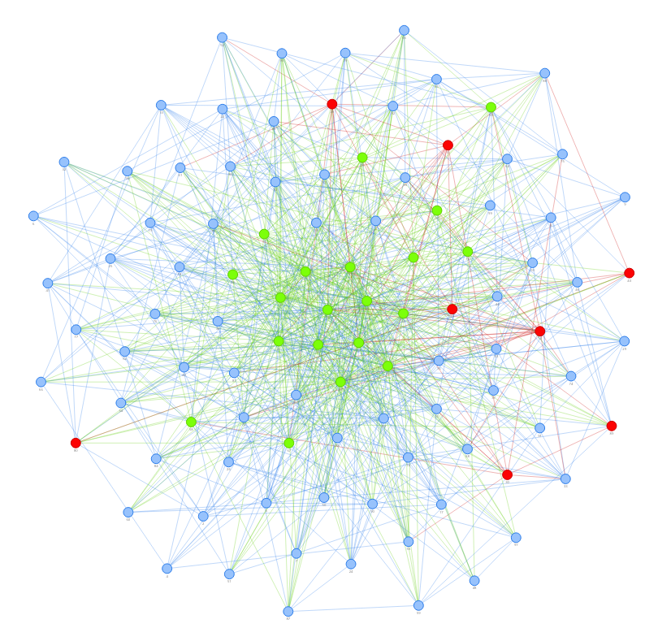

# SimuInfNet
This is a simulator of COVID-19 transmission model constructed by pyvis.  
We can preview the result by adjusting the parameters.

OVERVIEW
--------
Here is example:  

The node color means:  
*   Red: infected
*   Green: vaccinated
*   Blue: neither infected nor vaccinated

The first seed is node 0.  

Node in the middle area means more social activity with other persons and less in the marginal zone.  

This model tell us that we might protect 95% people by vaccinating 25% persons with [*mRNA vaccines*] [1] in the middle area if we take immediate action in the first 5-10 days.

If you have any idea for improving this project, please don’t hesitate to let me know.  

REFERENCE
---------
[1] https://www.cdc.gov/coronavirus/2019-ncov/science/science-briefs/fully-vaccinated-people.html  "mRNA vaccines"  
