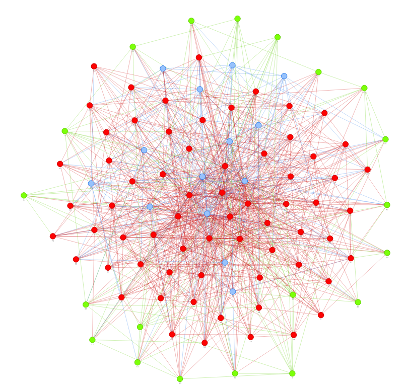

# SimuInfNet
This is a simulator of COVID-19 transmission model constructed by pyvis.  
We can preview the result by adjusting the parameters.

FEATURE
-------
*   modified [SIR model] [1] (use vaccination instead of recovery).
*   designed by multiprocessing pattern for computing effecacy improving on multiple CPUs machine.
*   infecitivity variate with time
*   one person usually will interactive with the same people, and this model adopts this rule. However, we determin the contact people number by uniform probability (default between 0.9-1).
*   the probability of be infected is determinated by the patient's infecitivity. 

OVERVIEW
--------
Here are examples:  

### Above are two different vaccination strategy.
The 1st one is vaccination on people who less contact with others, ane the 2nd is on those more social activities.
These two pictures are simulated under the same conditions, but just different vaccination strategy.  
Obviously, the latter can protect more people who have not been vaccinated(the blue nodes).  

The node color means:  
*   Red: infected
*   Green: vaccinated
*   Blue: neither infected nor vaccinated

The first seed is node 0.  

Node in the middle area means more social activity with other persons and less in the marginal zone.  

This model tell us that we might protect 85% people by vaccinating 25% persons with [*mRNA vaccines*] [2] in the middle area if we take immediate action in the first 5-10 days.

If you have any idea for improving this project, please don’t hesitate to let me know.  

LIMITATION
----------
*   not consider mortality and its effect.
*   not consider effect of social distance.

REFERENCE
---------
[1] https://www.maa.org/press/periodicals/loci/joma/the-sir-model-for-spread-of-disease-the-differential-equation-model "SIR model"  
[2] https://www.cdc.gov/coronavirus/2019-ncov/science/science-briefs/fully-vaccinated-people.html  "mRNA vaccines"  
